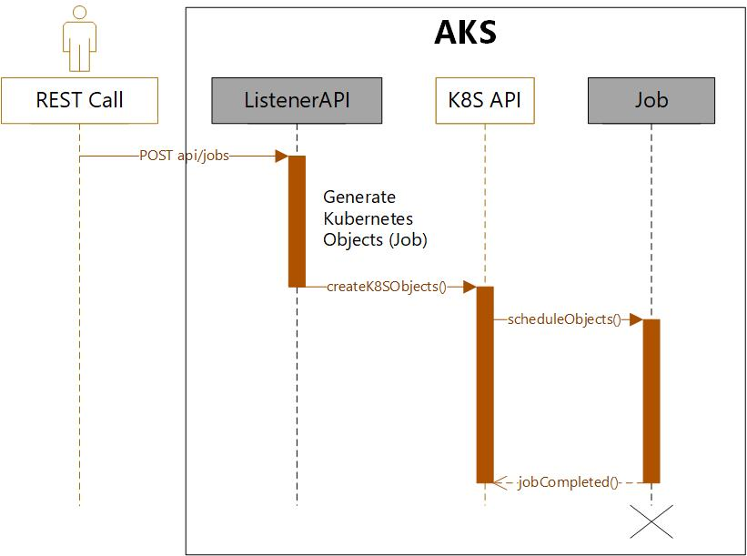

# Kubernetes C# client example used within the AKS cluster

## Overview

This repository ([c-sharp-k8s-client](https://github.com/embergershared/c-sharp-k8s-client)) uses the [C# .NET Kubernetes client](https://github.com/kubernetes-client/csharp) within an [ASP.NET Core in .NET 8.0 C# WebAPI](https://learn.microsoft.com/en-us/aspnet/core/web-api/?view=aspnetcore-8.0), as a NuGet Package (`KubernetesClient`), called `ListenerAPI` to access, manipulate and administer Kubernetes objects while running in the cluster itself.

Specifically, the Listener exposes 3 WebAPIs to:

1. List `namespaces`,
2. List `pods`,
3. Create `jobs`, providing their name (but can easily be expanded to a `JSON` definition payload).

The kubernetes jobs are created using the image `jobworker:dev` to perform tasks, then complete.

The code and images are organized in this manner:

Role | Project Name | [.NET template](https://learn.microsoft.com/en-us/dotnet/core/project-sdk/overview) | Visual Studio Project | Docker Image Name
---------|----------|---------|---------|---------
 WebAPI Listener | `ListenerAPI` | ASP.NET Core Web API | `src/ListenerAPI/ListenerAPI.csproj` | `listenerapi:dev`
 Job Worker | `Job` | Worker Service | `src/Job/Job.csproj` | `jobworker:dev`

## Figure

The process is represented by this UML Sequence diagram to create `jobs`:

## Azure Service Bus Messages trigger

The above feature works with a `HTTP(S) POST` on `api/Jobs`(the **Job controller**) with a job name parameter.
It then creates a Kubernetes job: it creates a pod from the job image and run it until completed.

An additional requirement was added to trigger a job from a `received Azure Service Bus Message`.
To do that, the following has been added:

- a `api/Messages` Controller to Create and Delete Service Bus Messages,
- a `SbProcessor` Background task that listens to messages. It could then create Jobs based on the message (code is not implemented), and it can be turned `ON`/`OFF`.

## Links

Description | Link
---------|----------
 This repository | [embergershared/c-sharp-k8s-client](https://github.com/embergershared/c-sharp-k8s-client)
 The C# Kubernetes client GitHub repo | [C# .NET Kubernetes client](https://github.com/kubernetes-client/csharp)
 Bridge to Kubernetes tool to redirect an AKS service to a local dev machine for debug purposes | [Bridge to Kubernetes overview](https://learn.microsoft.com/en-us/visualstudio/bridge/overview-bridge-to-kubernetes)
 Microsoft Learn ASP.NET Core WebAPI Overview | [ASP.NET Core in .NET 8.0 C# WebAPI](https://learn.microsoft.com/en-us/aspnet/core/web-api/?view=aspnetcore-8.0)
 Dependency injection with the Azure SDK for .NET | [Dependency injection with the Azure SDK for .NET](https://learn.microsoft.com/en-us/dotnet/azure/sdk/dependency-injection?tabs=web-app-builder)
 Azure Identity Client | [Azure Identity client library for .NET](https://github.com/Azure/azure-sdk-for-net/blob/Azure.Identity_1.11.0/sdk/identity/Azure.Identity/README.md)
 .NET Core `IHostedService` to build Hosted services / background tasks | [Background tasks](https://learn.microsoft.com/en-us/aspnet/core/fundamentals/host/hosted-services?view=aspnetcore-8.0&tabs=visual-studio)
 Azure Service Bus client library for .NET | [Azure Service Bus client library for .NET](https://learn.microsoft.com/en-us/dotnet/api/overview/azure/messaging.servicebus-readme?view=azure-dotnet)
 Azure Service Bus technical documentation | [What is Azure Service Bus?](https://learn.microsoft.com/en-us/azure/service-bus-messaging/service-bus-messaging-overview)
 Azure Service Bus queues quickstarts .NET | [Send and receive messages from an Azure Service Bus queue](https://learn.microsoft.com/en-us/azure/service-bus-messaging/service-bus-dotnet-get-started-with-queues?tabs=passwordless)
 Azure Service Bus sample processor | [Service Bus Processor sample](https://learn.microsoft.com/en-us/azure/service-bus-messaging/service-bus-dotnet-get-started-with-queues?tabs=passwordless#add-the-code-to-receive-messages-from-the-queue)
 Azure Service Bus dependency injection | [Registering Service Bus client with ASP.NET Core](https://learn.microsoft.com/en-us/dotnet/api/overview/azure/messaging.servicebus-readme?view=azure-dotnet#registering-with-aspnet-core-dependency-injection)
